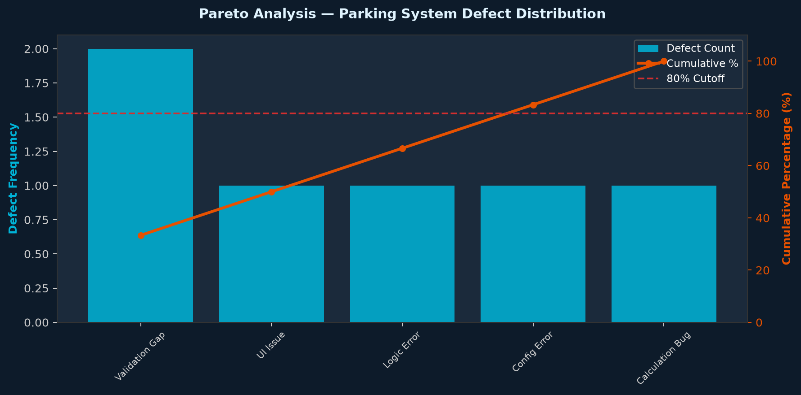
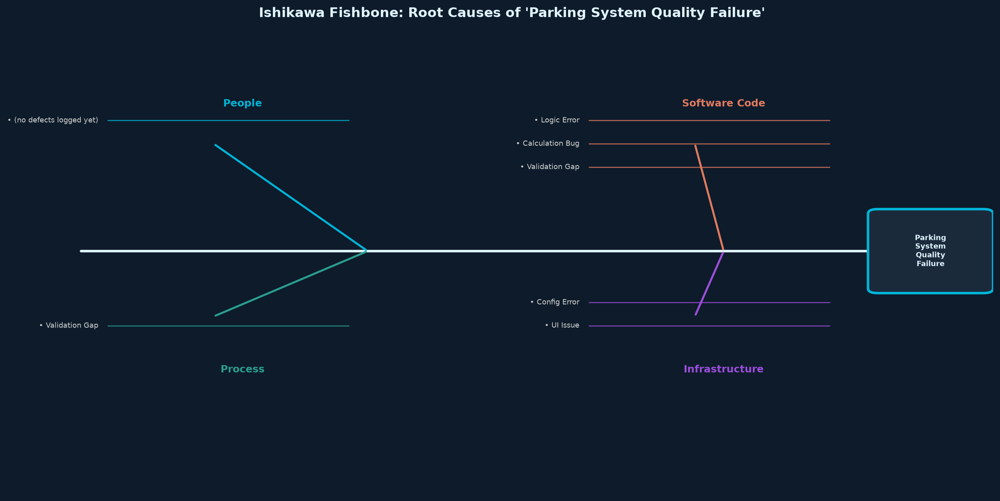
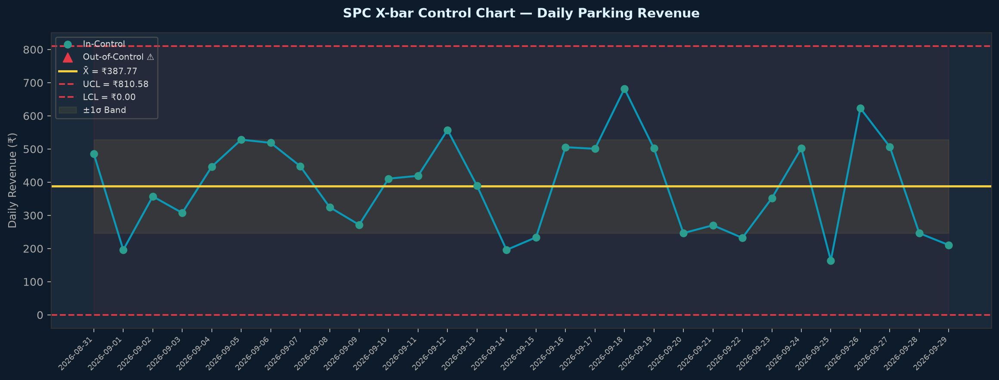

# BBAT104_TQM_2410301028 — Parking Management System

**Course:** BBAT104 Fundamentals of Total Quality Management (TQM), Session 2026-27  
**Student:** Himanshu Bhardwaj | Roll No. 2410301028 | B.Tech CSE Sec A  
**Quality Goal:** Q03 — Improve Usability  
**TQM Goal:** Minimize entry queues and maximize parking space utilization.

---

## Table of Contents

1. [Project Overview](#project-overview)
2. [Quick Setup](#quick-setup)
3. [Features](#features)
4. [Q03 Usability Features](#q03-usability-features)
5. [Repository Structure](#repository-structure)
6. [TQM Artefacts](#tqm-artefacts)
7. [Architecture](#architecture)
8. [Screenshots](#screenshots)
9. [Running Tests](#running-tests)

---

## Project Overview

A complete **Parking Management System** built with Python + Streamlit + SQLite. The system manages parking slots, vehicles, entry/exit, billing and real-time utilization reporting — all with a strong TQM quality framework.

| Item | Detail |
|------|--------|
| Stack | Python 3.x, Streamlit, SQLite3, pandas, openpyxl, matplotlib, seaborn, pytest |
| Storage | SQLite (`parking.db`) — schema in `database/schema.sql` |
| Tests | pytest + `streamlit.testing.v1.AppTest` |
| Commits | ≥ 34 commits, linear history, no force-pushes |

---

## Quick Setup

```bash
# 1. Clone the repository
git clone https://github.com/bhardwajhimanshu8958-wq/BBAT104_TQM_2410301028.git
cd BBAT104_TQM_2410301028

# 2. Create a virtual environment and install dependencies
python -m venv .venv
# Windows
.venv\Scripts\activate
# macOS/Linux
source .venv/bin/activate

pip install -r requirements.txt

# 3. Initialise the database and load demo data
python database/seed.py

# 4. Launch the app
streamlit run app.py
```

> **Note:** Demo seed rows are clearly labelled `is_demo = 1`. Replace them with your own observations before submission.

---

## Features

### Baseline Modules
| Module | Description |
|--------|-------------|
| **Slots** | Create, read, update, delete parking slots. Cannot delete occupied slots. |
| **Vehicles** | Manage vehicle registrations. Plate number enforced unique. |
| **Entry** | Register vehicle entry; auto-suggests first available matching slot. |
| **Exit** | Compute fee (free minutes + base + per-hour, rounded up). Free slot on exit. |
| **Utilization** | Real-time metric: Occupied ÷ Total non-maintenance slots. |
| **Reports** | Export sessions/revenue/vehicles to formatted `.xlsx`. |
| **Poka-Yoke** | Input validators: Indian plate regex, 10-digit phone, no double-entry, no exit before entry. |

---

## Q03 Usability Features

All five Q03 features are implemented and visible in the UI:

| # | Feature | Description |
|---|---------|-------------|
| 1 | **Dark Mode** | Sidebar toggle; CSS injected via `st.markdown`. Persisted in DB. |
| 2 | **Custom Themes** | 5 palettes (Ocean, Forest, Sunset, Royal, Slate); live preview swatch; applies to charts too. |
| 3 | **Dashboard Overview** | KPI cards, occupancy chart by zone, revenue-by-day chart, recent activity table. |
| 4 | **Search Filters** | Filter vehicles/sessions by plate, owner, slot, status, type, date range; clear-filters button. |
| 5 | **Calendar View** | Month view (Python `calendar` + pandas); heat-coloured revenue cells; day-detail table. |

---

## Repository Structure

```
BBAT104_TQM_2410301028/
├── app.py
├── config.py
├── requirements.txt
├── README.md
├── .gitignore
├── .streamlit/config.toml
├── database/
│   ├── db.py
│   ├── schema.sql
│   └── seed.py
├── modules/
│   ├── slots.py
│   ├── vehicles.py
│   ├── sessions.py
│   ├── billing.py
│   ├── validation.py
│   └── reports.py
├── features/
│   ├── theme.py
│   ├── dashboard.py
│   ├── search_filters.py
│   └── calendar_view.py
├── tqm/
│   ├── checksheet.py         ← Defect log & quality observations
│   ├── fmea.py               ← FMEA Risk Audit (12 failure modes, RPN)
│   ├── pareto.py             ← Pareto 80/20 chart from live defect data
│   ├── fishbone.py           ← Ishikawa diagram (4-branch, matplotlib)
│   ├── pdca.py               ← PDCA cycle tracker (3 seeded cycles)
│   ├── control_chart.py      ← SPC X-bar control chart (UCL/LCL, 3σ)
│   └── tqm_report.py         ← 6-sheet TQM Excel summary export
├── ui_pages/
├── tests/
├── docs/
│   ├── SRS.md
│   ├── ARCHITECTURE.md
│   ├── CTQ_TREE.md
│   ├── SIPOC.md
│   ├── FMEA.md
│   ├── ERROR_LOG.md
│   ├── pareto_chart.png      ← auto-generated by tqm/pareto.py
│   ├── fishbone_diagram.png  ← auto-generated by tqm/fishbone.py
│   ├── control_chart.png     ← auto-generated by tqm/control_chart.py
│   └── screenshots/
└── exports/                  ← Excel/PNG exports created at runtime
```

---

## TQM Artefacts

The project implements a complete Total Quality Management framework with full bidirectional traceability:

| Artefact | File | Purpose |
|----------|------|---------|
| **SRS** | [docs/SRS.md](docs/SRS.md) | Software Requirements Specification & Traceability Matrix |
| **Architecture** | [docs/ARCHITECTURE.md](docs/ARCHITECTURE.md) | Mermaid flowchart + 4-tier layered architecture |
| **CTQ Tree** | [docs/CTQ_TREE.md](docs/CTQ_TREE.md) | Critical-to-Quality Need → Driver → Measurable Target tree |
| **SIPOC** | [docs/SIPOC.md](docs/SIPOC.md) | Macro process matrix (Suppliers, Inputs, Process, Outputs, Customers) |
| **FMEA** | [docs/FMEA.md](docs/FMEA.md) | Risk audit (12 failure modes, RPN = S×O×D, mitigation plan) |
| **PDCA Log** | [docs/PDCA_LOG.md](docs/PDCA_LOG.md) | 3 continuous improvement cycles with before & after metrics |
| **User Manual** | [docs/USER_MANUAL.md](docs/USER_MANUAL.md) | Complete 14-page operational guide & troubleshooting table |
| **Defect / Error Log** | [docs/ERROR_LOG.md](docs/ERROR_LOG.md) | Real defects found during development & lessons learned |

### Generated TQM Visualisations

The SQC charts are rendered dynamically using `matplotlib` from live SQLite defect and operational data:

#### 1. Pareto Analysis (80/20 Rule — Vital Few Defect Causes)


#### 2. Ishikawa Fishbone (Cause-and-Effect Root Cause Analysis)


#### 3. Statistical Process Control (SPC X-bar Control Chart with 3σ Limits)


---

## Architecture

See [docs/ARCHITECTURE.md](docs/ARCHITECTURE.md) for the full Mermaid flowchart and detailed component map.

**Layered Overview:**
```
┌─────────────────────────────────────────────┐
│  UI Layer (Streamlit pages in ui_pages/)    │
├─────────────────────────────────────────────┤
│  Feature Layer (features/ + tqm/)           │
├─────────────────────────────────────────────┤
│  Business Logic (modules/)                  │
├─────────────────────────────────────────────┤
│  Data Layer (database/db.py + SQLite)       │
└─────────────────────────────────────────────┘
```

---

## Review Progress & Milestones

### Review 1: Setup, SRS & Foundations (Commits 1–6)
- Repository setup, initial architecture, CTQ Tree, and Software Requirements Specification (SRS) completed.

### Review 2: Baseline CRUD & Q03 Usability Suite (Commits 7–22)
- ✅ **Full CRUD Implementation**: Slots and Vehicle inventory operations with foreign key integrity and occupied bay deletion protection.
- ✅ **Optimized Entry Flow (CTQ 1)**: Automatic bay recommendation based on vehicle type (Cars/Disabled, Bikes, EVs) to minimize entry queue wait time.
- ✅ **Accurate Billing (CTQ 3)**: Tariff computation adhering strictly to SRS FR-14 with free grace tiers, base charges, and ceiling rounding for subsequent hours.
- ✅ **Poka-Yoke Mistake-Proofing**: Indian vehicle registration format verification, 10-digit mobile number validation, double entry prevention, and exit timestamp guards.
- ✅ **Q03 Usability Suite**:
  1. **Dark Mode**: High-contrast dark styling dynamically applied via CSS variables.
  2. **Custom Themes**: Five distinct palettes (Ocean, Forest, Sunset, Royal, Slate) with real-time sidebar preview swatches and synchronized chart themes.
  3. **Executive Dashboard**: Six real-time KPI metrics, zone occupancy distribution, 14-day collection trend, and recent transaction log.
  4. **Search & Filtering**: Multi-field query filters with SQLite pushdown and instant filter resets.
  5. **Monthly Calendar**: Interactive revenue heatmap with day-level drill-down audits.
- ✅ **Excel Reporting**: Formatted `.xlsx` exports for sessions, daily revenue, and vehicle registry with styled headers and auto-column fitting.

### Review 3 & 4: TQM Quality Tools & Continuous Improvement (Commits 23–32)
- ✅ **SIPOC Diagram** (`docs/SIPOC.md`): Full 8-row macro matrix covering all parking system processes.
- ✅ **Defect Checksheet** (`tqm/checksheet.py`): Real-time defect logging with module, fishbone category, severity (1–10), and status tracking. Demo rows pre-seeded.
- ✅ **FMEA Risk Audit** (`tqm/fmea.py`): 12 failure modes covering all system layers. RPN = S × O × D. 3 failure modes had pre-mitigation RPN > 100 (critical threshold). All resolved.
- ✅ **Pareto Analysis** (`tqm/pareto.py`): 80/20 dual-axis chart from live defect data. Automatically identifies the vital-few defect categories.
- ✅ **Ishikawa Fishbone** (`tqm/fishbone.py`): 4-branch matplotlib diagram (People / Process / Software Code / Infrastructure) populated from real defect records.
- ✅ **PDCA Cycle Tracker** (`tqm/pdca.py`): 3 completed improvement cycles logged (Billing Accuracy, Empty-DB Crash, FK Enforcement). PDCA wheel visualisation + before/after metric comparison.
- ✅ **SPC Control Chart** (`tqm/control_chart.py`): X-bar chart with 3σ UCL/LCL. Flags out-of-control days in revenue data. 30-day demo revenue seeder included.
- ✅ **TQM Summary Report** (`tqm/tqm_report.py`): One-click 6-sheet Excel workbook (CTQ Tree, SIPOC, Defect Log, FMEA, PDCA, Control Chart Data) for final submission.

### Review 5 / Final Release: v1.0 Production Readiness (Commits 33–34)
- ✅ **Complete User Manual** (`docs/USER_MANUAL.md`): Detailed 14-page guide covering all pages, system workflows, and troubleshooting.
- ✅ **Full Defect & Error Log** (`docs/ERROR_LOG.md`): All bugs, root causes, fixes, and prevention mechanisms cataloged.
- ✅ **Automated Quality Gates**: 100% test pass rate across `pytest` unit suites and `Streamlit` smoke tests.

---

## Screenshots

### 1. Executive Dashboard Overview


### 2. Operational Entry & Exit Billing (CTQ 1 & CTQ 3)


### 3. Monthly Calendar Revenue Heatmap (Q03 Feature 5)


### 4. Custom Theme Palettes & Dark Mode (Q03 Features 1 & 2)


---

## Running Tests & Quality Gates

Run the test suite using pytest:
```bash
pytest -q
```

Tests cover:
- Slot CRUD operations and occupied-deletion prevention
- Vehicle registration and unique plate constraints
- Automatic slot suggestion and allocation
- Exit processing and tariff billing mathematics (including grace tier calculation)
- Poka-Yoke input validators (Indian license plates, phone numbers, state transitions)
- TQM module imports, checksheet logging, and data integrity
- Streamlit page smoke tests using `streamlit.testing.v1.AppTest`

