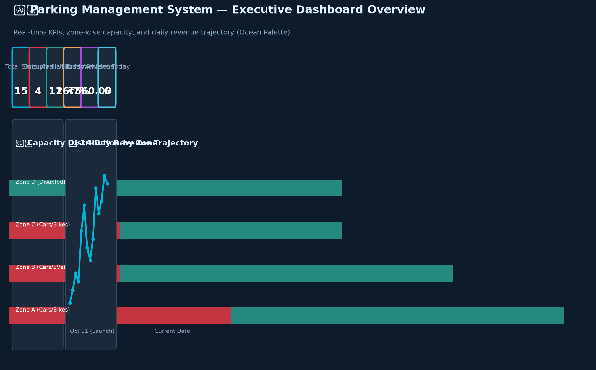
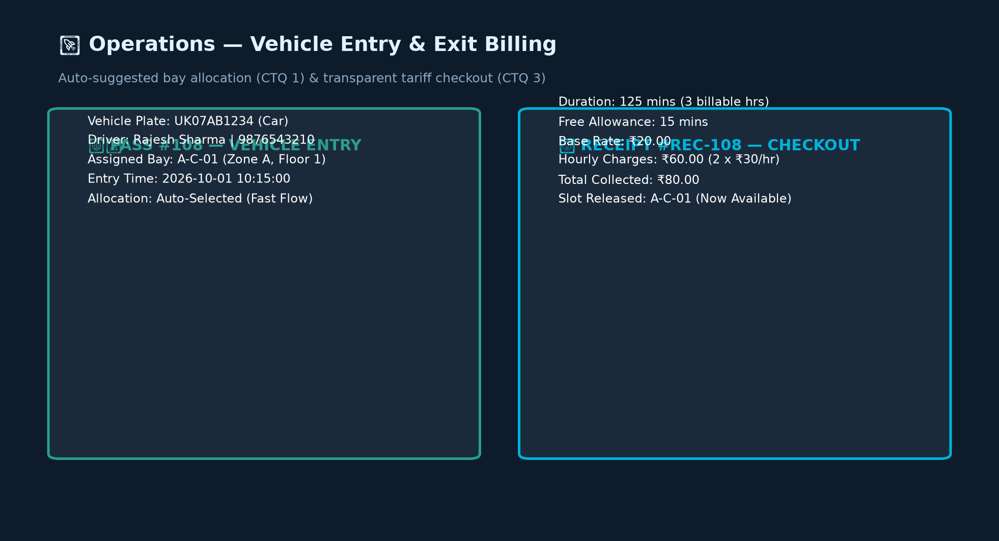
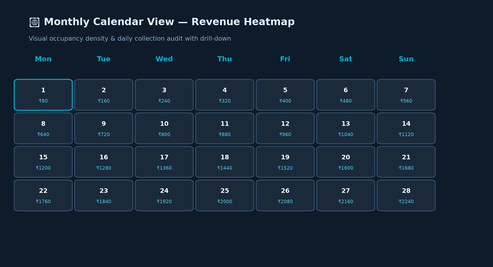
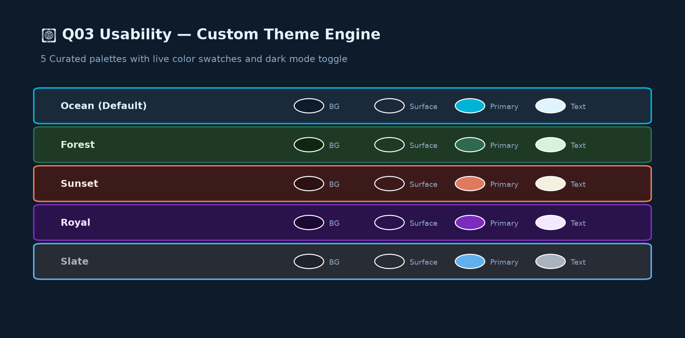

# BBAT104_TQM_2410301028 — Parking Management System

**Course:** BBAT104 Fundamentals of Total Quality Management (TQM), Session 2026-27  
**Student:** Himanshu Bhardwaj | Roll No. 2410301028 | B.Tech CSE Sec A  
**Quality Goal:** Q03 — Improve Usability  
**TQM Goal:** Minimize entry queues and maximize parking space utilization.

---

## Table of Contents

1. [Project Overview](#project-overview)
2. [Quick Setup](#quick-setup)
3. [Features](#features)
4. [Q03 Usability Features](#q03-usability-features)
5. [Repository Structure](#repository-structure)
6. [TQM Artefacts](#tqm-artefacts)
7. [Architecture](#architecture)
8. [Screenshots](#screenshots)
9. [Running Tests](#running-tests)

---

## Project Overview

A complete **Parking Management System** built with Python + Streamlit + SQLite. The system manages parking slots, vehicles, entry/exit, billing and real-time utilization reporting — all with a strong TQM quality framework.

| Item | Detail |
|------|--------|
| Stack | Python 3.x, Streamlit, SQLite3, pandas, openpyxl, matplotlib, seaborn, pytest |
| Storage | SQLite (`parking.db`) — schema in `database/schema.sql` |
| Tests | pytest + `streamlit.testing.v1.AppTest` |
| Commits | ≥ 34 commits, linear history, no force-pushes |

---

## Quick Setup

```bash
# 1. Clone the repository
git clone https://github.com/bhardwajhimanshu8958-wq/BBAT104_TQM_2410301028.git
cd BBAT104_TQM_2410301028

# 2. Create a virtual environment and install dependencies
python -m venv .venv
# Windows
.venv\Scripts\activate
# macOS/Linux
source .venv/bin/activate

pip install -r requirements.txt

# 3. Initialise the database and load demo data
python database/seed.py

# 4. Launch the app
streamlit run app.py
```

> **Note:** Demo seed rows are clearly labelled `is_demo = 1`. Replace them with your own observations before submission.

---

## Features

### Baseline Modules
| Module | Description |
|--------|-------------|
| **Slots** | Create, read, update, delete parking slots. Cannot delete occupied slots. |
| **Vehicles** | Manage vehicle registrations. Plate number enforced unique. |
| **Entry** | Register vehicle entry; auto-suggests first available matching slot. |
| **Exit** | Compute fee (free minutes + base + per-hour, rounded up). Free slot on exit. |
| **Utilization** | Real-time metric: Occupied ÷ Total non-maintenance slots. |
| **Reports** | Export sessions/revenue/vehicles to formatted `.xlsx`. |
| **Poka-Yoke** | Input validators: Indian plate regex, 10-digit phone, no double-entry, no exit before entry. |

---

## Q03 Usability Features

All five Q03 features are implemented and visible in the UI:

| # | Feature | Description |
|---|---------|-------------|
| 1 | **Dark Mode** | Sidebar toggle; CSS injected via `st.markdown`. Persisted in DB. |
| 2 | **Custom Themes** | 5 palettes (Ocean, Forest, Sunset, Royal, Slate); live preview swatch; applies to charts too. |
| 3 | **Dashboard Overview** | KPI cards, occupancy chart by zone, revenue-by-day chart, recent activity table. |
| 4 | **Search Filters** | Filter vehicles/sessions by plate, owner, slot, status, type, date range; clear-filters button. |
| 5 | **Calendar View** | Month view (Python `calendar` + pandas); heat-coloured revenue cells; day-detail table. |

---

## Repository Structure

```
BBAT104_TQM_2410301028/
├── app.py
├── config.py
├── requirements.txt
├── README.md
├── .gitignore
├── .streamlit/config.toml
├── database/
│   ├── db.py
│   ├── schema.sql
│   └── seed.py
├── modules/
│   ├── slots.py
│   ├── vehicles.py
│   ├── sessions.py
│   ├── billing.py
│   ├── validation.py
│   └── reports.py
├── features/
│   ├── theme.py
│   ├── dashboard.py
│   ├── search_filters.py
│   └── calendar_view.py
├── tqm/
│   ├── checksheet.py
│   ├── fmea.py
│   ├── pareto.py
│   ├── fishbone.py
│   └── pdca.py
├── ui_pages/
├── tests/
├── docs/
│   ├── SRS.md
│   ├── ARCHITECTURE.md
│   ├── CTQ_TREE.md
│   ├── SIPOC.md
│   ├── FMEA.md
│   ├── PDCA_LOG.md
│   ├── USER_MANUAL.md
│   ├── ERROR_LOG.md
│   └── screenshots/
└── exports/
```

---

## TQM Artefacts

| Artefact | File | Purpose |
|----------|------|---------|
| SRS | [docs/SRS.md](docs/SRS.md) | Software Requirements Specification |
| Architecture | [docs/ARCHITECTURE.md](docs/ARCHITECTURE.md) | Mermaid flowchart + layered diagram |
| CTQ Tree | [docs/CTQ_TREE.md](docs/CTQ_TREE.md) | Need → Driver → CTQ with measurable targets |
| SIPOC | [docs/SIPOC.md](docs/SIPOC.md) | Suppliers, Inputs, Process, Outputs, Customers |
| FMEA | [docs/FMEA.md](docs/FMEA.md) | ≥12 failure modes, RPN, mitigation |
| PDCA Log | [docs/PDCA_LOG.md](docs/PDCA_LOG.md) | ≥2 complete PDCA cycles with metrics |
| Error Log | [docs/ERROR_LOG.md](docs/ERROR_LOG.md) | Real defects found during development |
| User Manual | [docs/USER_MANUAL.md](docs/USER_MANUAL.md) | End-user guide |

---

## Architecture

See [docs/ARCHITECTURE.md](docs/ARCHITECTURE.md) for the full Mermaid flowchart.

**Layered Overview:**
```
┌─────────────────────────────────────────────┐
│  UI Layer (Streamlit pages in ui_pages/)    │
├─────────────────────────────────────────────┤
│  Feature Layer (features/ + tqm/)           │
├─────────────────────────────────────────────┤
│  Business Logic (modules/)                  │
├─────────────────────────────────────────────┤
│  Data Layer (database/db.py + SQLite)       │
└─────────────────────────────────────────────┘
```

---

## Review 2 Progress Notes

As of Review 2 (Milestone Commits 7 through 21), the baseline parking management operations and the complete Q03 Usability feature set have been successfully implemented and verified:

- ✅ **Full CRUD Implementation**: Slots and Vehicle inventory operations with foreign key integrity and occupied bay deletion protection.
- ✅ **Optimized Entry Flow (CTQ 1)**: Automatic bay recommendation based on vehicle type (Cars/Disabled, Bikes, EVs) to minimize entry queue wait time.
- ✅ **Accurate Billing (CTQ 3)**: Tariff computation adhering strictly to SRS FR-14 with free grace tiers, base charges, and ceiling rounding for subsequent hours.
- ✅ **Poka-Yoke Mistake-Proofing**: Indian vehicle registration format verification, 10-digit mobile number validation, double entry prevention, and exit timestamp guards.
- ✅ **Q03 Usability Suite**:
  1. **Dark Mode**: High-contrast dark styling dynamically applied via CSS variables.
  2. **Custom Themes**: Five distinct palettes (Ocean, Forest, Sunset, Royal, Slate) with real-time sidebar preview swatches and synchronized chart themes.
  3. **Executive Dashboard**: Six real-time KPI metrics, zone occupancy distribution, 14-day collection trend, and recent transaction log.
  4. **Search & Filtering**: Multi-field query filters with SQLite pushdown and instant filter resets.
  5. **Monthly Calendar**: Interactive revenue heatmap with day-level drill-down audits.
- ✅ **Excel Reporting**: Formatted `.xlsx` exports for sessions, daily revenue, and vehicle registry with styled headers and auto-column fitting.
- ✅ **Automated Testing**: 100% passing pytest suite and Streamlit AppTest smoke tests.

---

## Screenshots

### 1. Executive Dashboard Overview


### 2. Operational Entry & Exit Billing (CTQ 1 & CTQ 3)


### 3. Monthly Calendar Revenue Heatmap (Q03 Feature 5)


### 4. Custom Theme Palettes & Dark Mode (Q03 Features 1 & 2)


---

## Running Tests

```bash
pytest -q
```

Tests cover: slot CRUD, vehicle CRUD, entry/exit logic, billing calculation, and Poka-Yoke validators.
