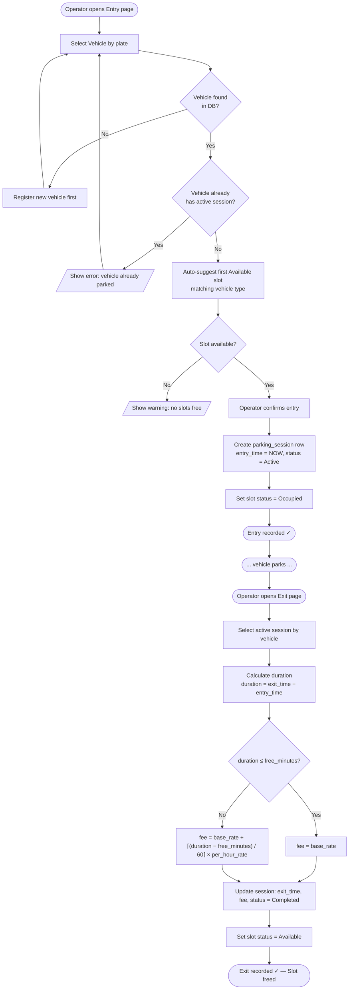
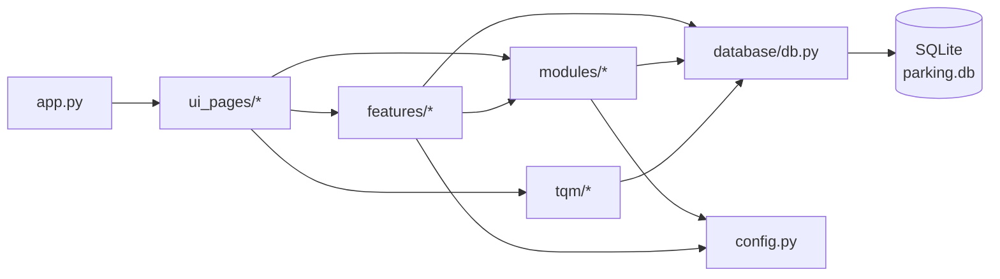
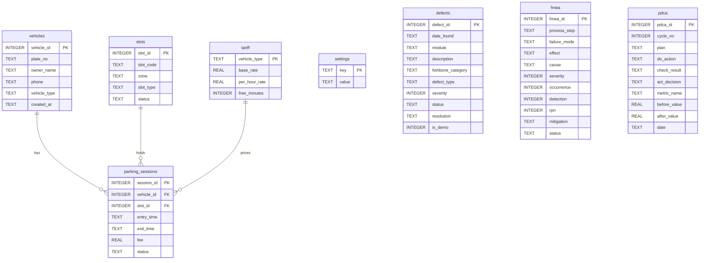

# System Architecture

**Project:** BBAT104 TQM — Parking Management System  
**Version:** 1.0 | Date: 2026-10-01

---

## 1. Layered Architecture

```
┌──────────────────────────────────────────────────────────────┐
│                     UI Layer (Streamlit)                      │
│  ui_pages/pg_dashboard.py  pg_slots.py  pg_vehicles.py       │
│  pg_entry.py  pg_exit.py  pg_reports.py  pg_calendar.py      │
│  pg_search.py  pg_checksheet.py  pg_fmea.py  pg_pareto.py   │
│  pg_fishbone.py  pg_pdca.py  pg_settings.py                  │
├──────────────────────────────────────────────────────────────┤
│              Feature + TQM Layer                              │
│  features/theme.py       features/dashboard.py               │
│  features/search_filters.py  features/calendar_view.py       │
│  tqm/checksheet.py  tqm/fmea.py  tqm/pareto.py              │
│  tqm/fishbone.py  tqm/pdca.py                                │
├──────────────────────────────────────────────────────────────┤
│              Business Logic Layer                             │
│  modules/slots.py    modules/vehicles.py                     │
│  modules/sessions.py  modules/billing.py                     │
│  modules/validation.py  modules/reports.py                   │
├──────────────────────────────────────────────────────────────┤
│              Data Layer                                       │
│  database/db.py  ── context manager, init_db()               │
│  database/schema.sql  database/seed.py                       │
│  SQLite: parking.db                                          │
└──────────────────────────────────────────────────────────────┘
```

---

## 2. Vehicle Entry-to-Exit Process Flowchart



---

## 3. Application Module Dependency Diagram



---

## 4. Database Entity-Relationship Overview



---

## 5. Technology Choices — Rationale

| Technology | Why chosen |
|------------|-----------|
| **Streamlit** | Rapid Python-native web UI; no JS/HTML required; page-based navigation with `st.navigation` suits a multi-module project |
| **SQLite3** | Zero-configuration embedded database; adequate for single-operator desktop use; schema enforced with CHECK constraints |
| **pandas** | Industry-standard DataFrame library; simplifies group-by, pivoting, and Excel export |
| **openpyxl** | Backend for pandas `.to_excel()`; allows header formatting and column-width control |
| **matplotlib + seaborn** | Standard SQC chart libraries; Pareto and Fishbone are well-supported; integrate with Streamlit via `st.pyplot()` |
| **pytest** | De-facto Python testing standard; supports both unit tests and Streamlit's `AppTest` smoke tests |
