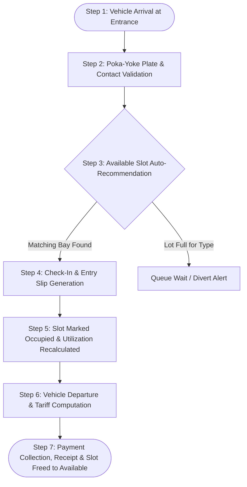

# SIPOC Analysis — Smart Parking Management System

**Course:** BBAT104 Fundamentals of Total Quality Management (TQM)  
**Student:** Himanshu Bhardwaj | Roll No: 2410301028 | Section: B.Tech CSE Sec A  
**Baseline System:** Automated Parking Management System  
**Strategic Focus:** Minimizing entry queue latency and maximizing space utilization.

---

## 1. Why SIPOC Was Chosen

**SIPOC (Suppliers, Inputs, Process, Outputs, Customers)** is a high-level process mapping tool used in Six Sigma and TQM prior to detailed process analysis.

It was chosen for this project because:
1. **Defines Process Boundaries**: Clearly marks where the parking management process begins (vehicle arrival at barrier gate) and where it terminates (vehicle checkout and exit departure).
2. **Identifies Critical Interfaces**: Prevents scope creep by distinguishing external stakeholder dependencies (inputs from drivers and sensor hardware) from system transformations.
3. **Establishes Quality Lineage**: Ensures that every customer expectation (e.g., fast entry, accurate billing) is directly traceable to specific inputs and operational process steps.

---

## 2. SIPOC Macro Matrix

```
┌─────────────┐     ┌─────────────┐     ┌─────────────┐     ┌─────────────┐     ┌─────────────┐
│  SUPPLIERS  │ ──► │   INPUTS    │ ──► │   PROCESS   │ ──► │   OUTPUTS   │ ──► │  CUSTOMERS  │
└─────────────┘     └─────────────┘     └─────────────┘     └─────────────┘     └─────────────┘
```

| Component | Entity / Description | Quality & Verification Criteria |
| :--- | :--- | :--- |
| **Suppliers** | 1. Vehicle Owners / Motorists<br>2. Facility Management Staff<br>3. Municipal Traffic Authority<br>4. Payment Gateway / Cashiers<br>5. Sensor / Gate Infrastructure | Verified registration records, calibrated induction loop sensors, reliable network connectivity. |
| **Inputs** | 1. Vehicle Details (Plate No, Type: Car/Bike/EV)<br>2. Driver Contact (10-digit mobile)<br>3. Facility Slot Availability Status<br>4. Tariff Rate Structure (Free tier, base, hourly)<br>5. Entry / Exit Timestamps | Poka-Yoke format checking (`UK07AB1234`), 10-digit phone verification, real-time bay availability status. |
| **Process** | *(5-7 Sequential Core Steps)*<br>1. Vehicle Arrival & Plate Detection<br>2. Driver Registration / Profile Lookup<br>3. Automated Slot Suggestion (Matching Vehicle Type)<br>4. Entry Authorization & Digital Pass Issuance<br>5. Occupancy State Update (Slot: Available → Occupied)<br>6. Checkout Request & Tariff Calculation<br>7. Payment Processing & Bay Release | Fast check-in (< 30s), 100% type-appropriate slot matching, transparent fee calculation with zero rounding errors. |
| **Outputs** | 1. Digital / Printed Entry Pass<br>2. Real-time Directional Bay Guidance<br>3. Live Facility Space Utilization Metrics<br>4. Official Itemized Billing Receipt<br>5. Re-allocated Available Slot Bay<br>6. Operational & Financial Excel Audit Reports | Clear receipt itemization (base fee, duration, free minutes deducted), automated `.xlsx` audit reports. |
| **Customers** | 1. Motorists & Vehicle Drivers<br>2. Parking Facility Operators<br>3. Facility Ownership / Accounts Audit<br>4. Municipal Traffic Controllers | Reduced wait times, stress-free bay location, verified receipts, and accurate occupancy insights. |

---

## 3. Detailed Process Flow (The 7 Core Steps)



### Process Step Details:
1. **Arrival & Scanning**: Vehicle approaches the entry gate; camera or operator inputs license plate.
2. **Poka-Yoke Validation**: System verifies that the plate matches standard formats (Indian regex) and confirms no active session already exists for this vehicle.
3. **Smart Bay Matching**: System queries the database for the closest available slot matching vehicle classification (EV bays with chargers, standard bays for cars, designated bays for bikes and disabled motorists).
4. **Pass Generation**: Entry time is stamped to the second; digital entry slip is created.
5. **Occupancy State Transition**: Slot status updates from `Available` to `Occupied` in SQLite with transaction safety; dashboard KPIs update instantly.
6. **Billing & Grace Application**: On departure, duration is calculated. If parking duration is under the free grace period (15 minutes), base rate applies without penalty. Otherwise, full hourly ceiling increments are applied.
7. **Release & Audit**: Payment confirmation closes the session, updates the slot to `Available`, logs revenue, and appends the transaction to audit records.

---

## 4. CTQ Linkage to SIPOC Elements

| SIPOC Stage | Critical Parameter | Target Metric | TQM Control Mechanism |
| :--- | :--- | :--- | :--- |
| **Input / Process** | Plate Number Accuracy | 100% regex conformance | `modules/validation.py` (`validate_plate`) |
| **Process Step 3** | Queue Processing Speed | < 30 seconds per vehicle | Automated slot recommendation algorithm |
| **Process Step 5** | Facility Space Utilization | > 80% during peak hours | Zone-wise real-time distribution tracking |
| **Process Step 6** | Billing Accuracy | 0 calculation discrepancies | Deterministic SQLite tariff table & ceiling rounding |
| **Output** | Report Availability | Immediate download (< 2s) | `modules/reports.py` Excel engine |
